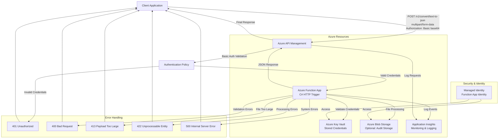

# Azure Text to JSON API - Architecture Diagram

## Architecture Components

### 1. **Azure API Management (APIM)**
- **Role**: API Gateway and authentication layer
- **Features**: 
  - Basic Authentication validation
  - Request routing to Function App
  - Rate limiting and throttling
  - Request/response transformation

### 2. **Azure Function App (C#)**
- **Role**: Backend processing service
- **Features**:
  - HTTP-triggered function for file processing
  - Credential validation via Key Vault
  - Text to JSON conversion logic
  - Error handling and logging

### 3. **Azure Key Vault**
- **Role**: Secure credential storage
- **Stored Secrets**:
  - API username/password for Basic Auth
  - Connection strings and certificates
  - Function App access policies

### 4. **Azure Blob Storage** (Optional)
- **Role**: Audit and backup storage
- **Features**:
  - Store original .txt files
  - Store processed JSON files
  - Enable data retention policies

### 5. **Application Insights**
- **Role**: Monitoring and observability
- **Features**:
  - Request/response logging
  - Performance metrics
  - Error tracking and alerting
  - Custom telemetry

## Data Flow

1. **Request**: Client sends POST request with .txt file and Basic Auth header
2. **Authentication**: APIM validates Basic Auth credentials
3. **Routing**: Valid requests are forwarded to Function App
4. **Credential Validation**: Function validates credentials against Key Vault
5. **File Processing**: Function reads .txt file and converts to JSON
6. **Storage** (Optional): Original and processed files stored in Blob Storage
7. **Logging**: All operations logged to Application Insights
8. **Response**: JSON response returned through APIM to client

## Security Features

- **Managed Identity**: Function App uses Managed Identity to access Key Vault and Blob Storage
- **HTTPS Only**: All communications encrypted in transit
- **Key Vault Integration**: Sensitive data stored securely
- **API Authentication**: Basic Auth with credential validation
- **Network Security**: Private endpoints and VNet integration (optional)
